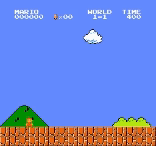
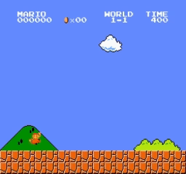

# Mario Environment Deep Learning Project - CNN + DQN

This project implements a deep learning framework using a Convolutional Neural Network (CNN) and a Deep Q-Network (DQN) to navigate and make decisions within the Mario environment. The CNN extracts features from the game states, which are then used by the DQN to decide the best actions to perform.

## Prerequisites

- **Python**: Python 3.7 or later.
- **PyTorch**: The project is built using the PyTorch library. Install it using pip:

  ```
  pip install torch torchvision
  ```

- **OpenAI Gym**: This project uses OpenAI Gym for the Mario environment. Install it with:

  ```
  pip install gym
  ```

- **TensorBoard**: For logging and visualizing the training process, TensorBoard is used:

  ```
  pip install tensorboard
  ```
  
- **nes_py**: NES emulator

  ```
  pip install nes_py
  ```

- **gym_super_mario_bros**: Gym environment for Super Mario Bros

  ```
  pip install gym_super_mario_bros
  ``
  
## Files

- `mario_agent.py`: This file contains the implementation of the `MarioAgent` class, which represents the AI agent. It includes the CNN model (`MarioCNN`) for feature extraction and the DQN algorithm for decision making. The agent interacts with the environment, stores experiences, and learns from them to improve its performance.

- `mario_env.py`: This file defines the Mario environment wrapper classes. It includes `SkipFrame` for skipping frames, `ResizeObv` for resizing observations, and `make_env` for creating the Mario environment with the necessary wrappers.

- `train_model.py`: This script is used to train the Mario AI agent. It creates the environment, initializes the `MarioAgent`, and trains it for a specified number of episodes. During training, the agent explores the environment, stores experiences, and learns from them using the DQN algorithm. The trained model is saved at regular intervals.

- `test_model.py`: This script is used to test the trained Mario AI agent. It loads a pre-trained model, creates the environment, and runs the agent for a specified number of episodes. The agent's performance is evaluated based on the rewards obtained and whether it reaches the flag (completes the level). The best episode frames are saved as a video.

## Training CNN + DQN

The `MarioAgent` class combines a CNN for feature extraction and a DQN for decision making. The training process involves the following steps:

1. The CNN model (`MarioCNN`) is defined with convolutional layers to extract features from the game observations.

2. The DQN algorithm is implemented within the `MarioAgent` class. It includes an online network and a target network, both using the CNN model as the underlying structure.

3. The agent interacts with the environment by selecting actions based on the current state. It uses an epsilon-greedy exploration strategy to balance exploration and exploitation.

4. Experiences (state, action, reward, next_state, done) are stored in a replay buffer.

5. During training, the agent samples a batch of experiences from the replay buffer and uses them to update the online network's parameters. The loss is computed using the TD estimate and TD target.

6. The target network's parameters are periodically synchronized with the online network's parameters to stabilize training.

7. The agent's performance is evaluated based on the rewards obtained during each episode, and the model is saved at regular intervals.

## Results

### Version 1: Training CNN and DQN Separately 

In the first version, the CNN and DQN were trained separately. The CNN was trained to extract features from the game observations, while the DQN was trained to make decisions based on the extracted features. However, this approach did not yield satisfactory results. The agent's performance was suboptimal, and it struggled to complete levels consistently.

(Trained approx **20k** episodes totally - including testing)



### Version 2: Training CNN and DQN Together (Current Version)

In the current version, the CNN and DQN are trained together as a single model. The CNN serves as the feature extractor, and its output is directly fed into the DQN for decision making. By training the CNN and DQN jointly, the agent learns to extract relevant features and make decisions based on them in an end-to-end manner.

The results of this approach are significantly better. The agent learns to navigate through the levels more effectively and reaches the flag more consistently. The trained model demonstrates improved performance and achieves higher rewards compared to the previous version.

BEST MODEL: `comb_mario_models/mario_model_50000.pth`

(Trained approx **60k** episodes totally, **50hrs** on NVIDIA RTX 3070 - including testing)



## Conclusion

The combination of CNN and DQN provides a powerful framework for training AI agents to play Super Mario Bros. By training the CNN and DQN together, the agent learns to extract meaningful features and make informed decisions, resulting in improved performance and level completion. This project showcases the effectiveness of deep reinforcement learning techniques in tackling complex game environments.